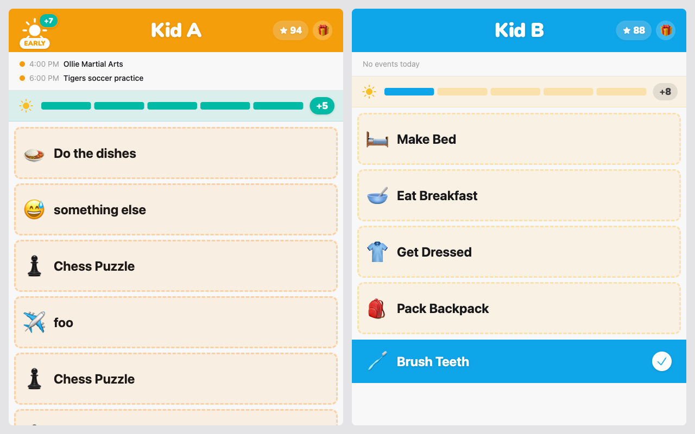
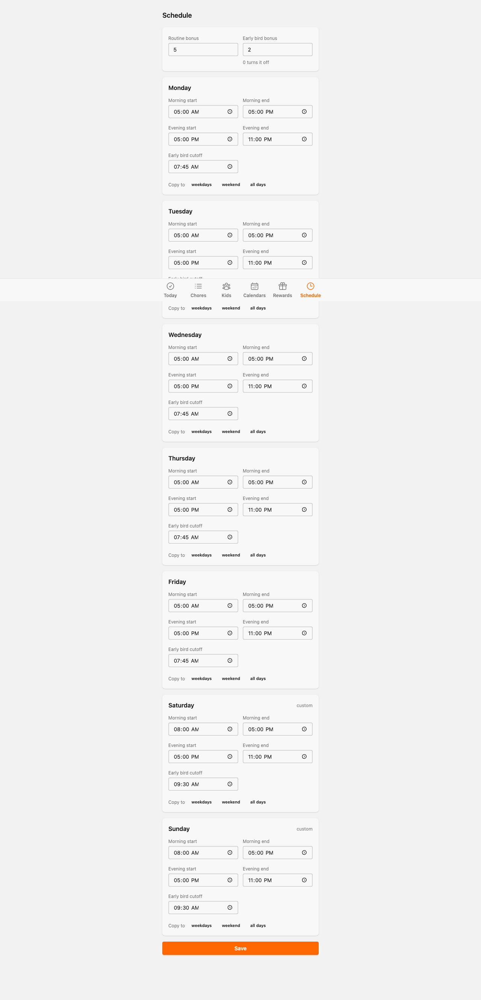

#+title: PLAN — routine-schedule
#+date: 2026-10-04

# Mutability: execution state. Story status and implementation observations are recorded here as LOGBOOK entries per the workflow-kit org-conventions skill. By phase close, this file should read as an accurate record of what was actually built.

Design: [[file:DESIGN.org]]

* Batch 1 — Routine schedule
:LOGBOOK:
- Note taken on [2026-10-05 Mon 00:20] \\
  Gate closed — verdict PASS, signed off by the human on the local kiosk review. (0) Local review at 1280 × 800 (PRD declares no further gate criteria): , staged with ~Scenarios.open(:morning)~ and ~midway/1~, then R raised 5 → 8 by a version insert, shows a paid card keeping its priced +7 EARLY badge and +5 chip beside an unfinished card's live +8 chip;  shows the Schedule page under ~slow_weekend/0~ with Saturday and Sunday marked custom. ~Scenarios.restore/0~ run afterwards. (1) ~mix precommit~ first ran red at 00:06: 799/801, two ~KioskLiveTest~ early-bird tests from Story 04 failing on the clock, not on behaviour. ~minutes_ago(10)~ staged taps on yesterday's date before 00:10, and the priced-badge test read +R+E before the 07:45 cutoff. Fixed test-only in =dc94516= (taps stay inside today; that test pins a midnight cutoff), then ~mix precommit~ green, 801/801. The [2026-07-17] learnings entry gained the date/cutoff half of the lesson. (2) DESIGN Key Behaviors walked against the code: pricing in one ~resolve/4~ for both routes and the kiosk, the seed via ~insert_all~ with literal JSON, the D124 timer ref, D130's paid chip, Today's subscription, the scenario stash. Two unrecorded divergences, both ruled by the human and landed by retroactive update-design: the shop and count panel closing on a schedule save is kept and minted [[file:../decisions.org::#d131][D131]] (Story 03); the env vars' deletion in Story 04, not "the same change", is a repair Advisory (Story 04). (3) PLAN audit: all five stories truthfully DONE; Story 04's one ~[-]~ is in its LOGBOOK and in Deferred. (4) Advisories: 0 withdrawn, 0 promoted; all four from implementation still guard live shapes, and two were added at this gate. (5) Shared log: no duplicate numbers, no other chain's supersession since D120. Backlog swept on the human's ruling: the config-drift and default-pin entries moved to ~docs/completed.org~, and the stale ~BEAR_CUB_*~ dev recipe bullets were deleted. The post-deploy checklist still owes "kiosk totals identical before and after deploy" (SC-5) on the tablet.
:END:

# Stories in this batch nest below as org TODOs, listed in implementation order; status updates get LOGBOOK entries under the story heading. At phase-close the gate record for this batch lands here as a LOGBOOK entry on the batch heading — its presence marks the batch closed. At most one batch is open (has no gate record) at a time; new batches are appended by later user-stories runs, never over an open one.

# Order: the data layer first, additive and read by nothing. Then the derivation moves onto it, with
# the domain tests' config pins converted alongside. Then routine resolution and the live
# ~:schedule_changed~ path move onto it, together with the default LiveView test pin and the
# scenario rewrite: once windows come from versions, every ~put_env~ pin and scenario goes inert at
# once. Then the kiosk figures, which removes the last config reader and so retires the config
# (see the GAP in Stories 01 and 04). The admin page depends only on Story 01 and could move
# earlier; it is last so that a save has a visible effect on an open kiosk.

** DONE [[file:stories/story-01-schedule-versions.org][Story 01 — The schedule versions table, version 0, and the Schedules context]]
:LOGBOOK:
- Note taken on [2026-10-04 Sun 22:46] \\
  Implementation clarifications for later stories, none changing DESIGN. (1) ~Schedules.change/1~ is ~change(attrs, now \\ DateTime.utc_now())~: the optional ~now~ is a test seam, and the clock is still read only at the context boundary. (2) ~ScheduleVersion.changeset/2~ never casts ~effective_at~; ~ScheduleVersion.effective_at/2~ stamps it and carries the ~unique_constraint~. So the form changeset from ~change_version/1~ validates without one, and a same-second collision surfaces as an ~:effective_at~ changeset error. (3) A no-op save returns ~{:ok, current}~, the existing version unchanged. Story 05 can tell "nothing to save" from "saved" by comparing the returned ~id~ with the one in force before the save. (4) Error field attribution, for Story 05's per-day-card rendering: a window whose start is not before its end errors on ~:morning_end~ / ~:evening_end~; a morning ending after the evening starts errors on ~:evening_start~; a cutoff outside the morning errors on ~:early_bird_cutoff~; the weekday-set and bonus errors sit on the version (~:days~, ~:routine_bonus~, ~:early_bird_bonus~). (5) Because ~change_version/1~ prefills from ~current/0~ and ~days~ is ~on_replace: :delete~, a submitted ~days~ list leaves the seven prefilled entries in ~changes.days~ with action ~:replace~ alongside the new ones. ~inputs_for~ skips those, but code that indexes ~changes.days~ or ~errors_on(cs).days~ positionally must not. (6) The story's GAP is still open for a human ruling: the five ~BEAR_CUB_*~ routine variables and their ~runtime.exs~ parsing remain until Story 04, against the excerpt's "in the same change". Nothing reads the new table yet and config equals version 0, so behaviour is identical meanwhile.
:END:
** DONE [[file:stories/story-02-priced-derivation.org][Story 02 — Each points term priced by the schedule in force at its instant]]
:LOGBOOK:
- Note taken on [2026-10-04 Sun 22:58] \\
  Implementation clarifications for later stories, none changing DESIGN. (1) The version list is the last argument: ~Chores.routine_day_contribution/4~ and ~Chores.early_bird?/3~ take ~versions~, with ~/3~ and ~/2~ conveniences that call ~Schedules.versions/0~. Story 04's ~routine_day_pricing/3~ should build on the private ~resolve/4~ and ~facts/1~ in ~Chores~, which ~contribution/4~ also uses, and pass the history down rather than call ~early_bird?/2~ per render. (2) ~routine_day_status/3~ now returns ~first_failed_at~; any test asserting the whole status map must include it. (3) ~earnings_by_kid/1~ is three queries (versions, extras leg, routine leg), and the existing query-count test was updated from 2 to 3. (4) The story's premise that the domain tests pin ~:routine_bonus~ / ~:early_bird_cutoff~ / ~:early_bird_bonus~ with ~put_env~ was false in this repo (only ~:routine_windows~ is pinned, which is Story 03's conversion), so no pins were converted; version 0 equals the config defaults, so the existing ~Routines.bonus()~ assertions still hold until Story 04 retires them. (5) ~Scenarios.cutoff/1~ now stages nothing the derivation reads, so do not use it for a visual review before Story 03 rewrites it.
:END:
** DONE [[file:stories/story-03-kiosk-follows-schedule.org][Story 03 — The kiosk and Today screen follow the schedule, live]]
:LOGBOOK:
- Note taken on [2026-10-04 Sun 23:18] \\
  Implementation clarifications for later stories. The two that change DESIGN are minted as [[file:../decisions.org::#d128][D128]] (~Schedules.day_entry/1~) and [[file:../decisions.org::#d129][D129]] (test pin mechanics). (1) ~KioskLive~'s ~:schedule_changed~ handler clears the reward shop and the count panel (~:rewards~, ~:counting~) exactly as ~:boundary~ does, so a parent's save closes a shop a kid has open. The choice was by analogy with [[file:../decisions.org::#d65][D65]], not ruled by the human; worth a look at the gate. (2) ~Scenarios.open/1~, ~cutoff/1~ and ~restore/0~ write in the same second as the newest version only by waiting out the rest of that second, so the new version is in force the moment it lands. Back-to-back scenario calls therefore take up to a second. (3) ~Scenarios~ broadcasts ~:schedule_changed~ itself, since ~Repo.insert!~ bypasses ~Schedules.change/1~; ~reset/1~ still broadcasts ~:chores_changed~. (4) Story 04: the test helpers in ~BearCub.ScheduleHelpers~ write ~early_bird_cutoff: ~T[07:45:00]~ on every day. A test that needs "nothing is early" should insert a version with an early cutoff, not ~put_env~. The Story 02 deferred item on ~kiosk_live_test.exs~'s ~:early_bird_cutoff~ pin (now line ~1020) is still open and lands in Story 04 with the badge figures. (5) Four domain test files (~points_test~, ~points_redemptions_test~, ~rewards_test~, ~chores/chore_lifecycle_migration_test~) and ~local_time_test.exs~ still read or ~put_env~ ~:routine_windows~. That is harmless now, and Story 04's config retirement must delete them, or those tests fail on the missing key.
:END:
** DONE [[file:stories/story-04-priced-figures-config-retired.org][Story 04 — Kiosk figures priced or live, and routine config retired]]
:LOGBOOK:
- Note taken on [2026-10-04 Sun 23:45] \\
  Implementation clarifications for later stories. The one that changes DESIGN is minted as [[file:../decisions.org::#d130][D130]] (a paid stake chip shows the priced ~R~); the Today screen's "figures priced as above" line was a repair, and AC 4 was deferred by the human because Today renders no routine figures. (1) The GAP that Stories 01 and 04 share on "deleted in the same change" is still unruled: the five ~BEAR_CUB_*~ routine variables went in Story 04, not with the table in Story 01. The batch deploys as one unit, so production never runs with both. DESIGN's Seed paragraph still says "the same change"; settle it at the gate. (2) ~BearCub.ScheduleHelpers~ gained ~put_cutoff/1~ (a midnight cutoff makes nothing early, whatever the clock) and ~put_bonuses/3~, whose optional ~at~ is shifted to UTC. A test that stages an earn or a fail and then raises ~R~ must pass an ~at~ after those instants: the default stamps one second after the latest version, which under the default pin is an hour back, so it would land /before/ a completion made at the real clock. (3) ~put_windows/2~ now carries the current cutoff forward rather than resetting it to 07:45, so a ~put_cutoff/1~ in setup survives a later ~morning_active/0~. (4) Story 05: ~Schedules.change/1~ in the same second as the newest version fails on ~:effective_at~. A dev session saving right after a scenario write hits it, and so would a double-tapped Save; the form should show that error rather than swallow it.
:END:
** DONE [[file:stories/story-05-admin-schedule-page.org][Story 05 — The admin Schedule page]]
:LOGBOOK:
- Note taken on [2026-10-05 Mon 00:03] \\
  Implementation clarifications for the gate; none changes DESIGN. (1) Every save re-validates the whole schedule, so a version in force that the changeset would refuse cannot be saved back untouched. ~Scenarios.open/1~ writes such a version (a zero-length window) on purpose, so after it the Schedule page shows errors on every card until the parent fixes them or ~Scenarios.restore/0~ runs. Use ~Scenarios.slow_weekend/0~, which writes a valid version, to review this page. (2) For the same reason, the default LiveView test pin (evening never) cannot be saved from the page. ~schedule_live_test.exs~ inserts a valid version-0-shaped fixture half an hour back in its own setup. (3) A no-op save flashes "No changes to save", which the story did not specify. It is detected as Story 01 note (3) suggested: the returned ~id~ equals the one in force at mount. (4) "Copy to" keeps the unsaved form as a ~:params~ assign beside the form, because a click carries none of the form's values. Time inputs are normalised to =HH:MM=, because the changeset hands back a ~Time~ for cast values and the typed string otherwise. (5) A same-second ~:effective_at~ collision renders as an alert at the top of the form ("please try again"), not on a day card. (6) The admin tab bar is now six columns (~grid-cols-6~) with Schedule last. (7) The collision test waits for the start of a wall-clock second with ~Process.sleep/1~, an accepted deviation from the rules file because D119 stamps the real clock.
:END:

* Deferred

# Out-of-scope discoveries land here during implementation instead of being fixed inline. Promoted to v2 candidates at initiative close.

** Story 02 discoveries
- ~test/bear_cub_web/live/kiosk_live_test.exs:1060~ pins ~:early_bird_cutoff~ to 00:00 so nothing is ever early; that pin is now a silent no-op and the tests complete chores at the real clock, so before 07:45 local the badge assertions can show +R+E. A latent time-of-day flake. Convert it to a version insert in Story 03 or 04 (D119).
- ~BearCub.Dev.Scenarios.cutoff/1~ and ~ensure_config/2~'s ~:early_bird_cutoff~ write config that ~Chores~ no longer reads, and ~test/bear_cub/dev/scenarios_test.exs:24~ saves and restores the same dead key. Already covered by Story 03's scenario rewrite.
- ~Chores.early_bird?/2~ calls ~Schedules.versions/0~ on every call; the kiosk should pass the history down (Story 04's pricing helper).

** Story 04 discoveries
- ~docs/backlog.org~'s "testing dev overrides" note (the =BEAR_CUB_MORNING_WINDOW=…= recipe) is stale now that the variables are gone. Left unedited by the story; for the gate's backlog sweep.
- Admin Today renders no ~R~ / ~E~ / penalty figures, so Story 04's AC 4 (the priced/live split on Today) was deferred by the human as vacuous. Revisit only if Today is ever given routine figures. DESIGN now says so (repair Advisory).
- Resolved here, from Story 02's list: the ~kiosk_live_test.exs~ ~:early_bird_cutoff~ pin is now a ~put_cutoff(~T[00:00:00])~ version insert, and the kiosk passes the history down through ~routine_day_pricing/4~ instead of calling ~Chores.early_bird?/2~ per column. Story 03's note (5) is resolved too: the ~:routine_windows~ reads in four domain test files and ~local_time_test.exs~ are deleted.

** Story 05 discoveries
- ~mix precommit~ output carries ~[error] Task ... cannot find mock/stub BearCub.Notifications~ traces from fire-and-forget ~BearCub.Notifications.push/1~ tasks that call ~Req.Test~ with no stub in some tests. Test noise only, with no failure, outside the story's files.
- The dev Tailwind watcher was not running, and the cached ~_build/tailwind-macos-arm64-4.3.0~ had an invalid code signature, so macOS killed it (exit 137) and the served CSS went stale. It was re-signed locally with ~codesign --force --sign -~. A new Tailwind class in dev needs the watcher or ~mix tailwind bear_cub~ to appear.
